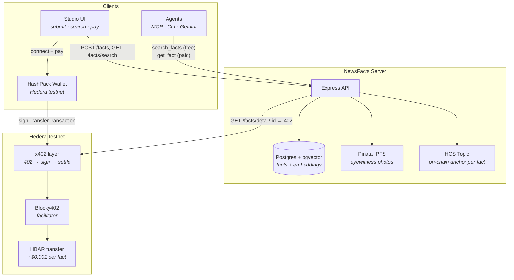

# NewsFacts

**Live demo:** https://130-210-48-232.sslip.io

NewsFacts is a pay-per-fact eyewitness report platform. Anyone can publish what they saw, anyone can search for free — but reading the **full** report costs a small HBAR payment settled on Hedera testnet via [x402](https://docs.hedera.com/solutions/ai/x402).

The same API works for humans in the browser and for AI agents over MCP. An agent can search summaries at no cost, then autonomously pay when it needs the complete fact.

Built for the [Hedera x402 Bounty](https://hedera.com/x402-bounty/) — Architecture 1: *agent pays per query*.

---

## The problem

Eyewitness information is valuable, but there's no simple way to:

1. **Publish** a report with photos and a verifiable timestamp
2. **Search** across reports without paying upfront
3. **Charge per read** — only when someone actually wants the full detail
4. Let an **AI agent** do all of this without a subscription or API key billing setup

NewsFacts solves this with a freemium fact store + HTTP 402 micropayments on Hedera.

---

## What you can do

### As a human (Studio UI)

| Action | Cost | What happens |
|---|---|---|
| Submit a fact | Free | Text + up to 3 photos stored; optional HCS on-chain anchor |
| Search facts | Free | Semantic search returns summaries, author, location, score |
| Read full detail | **0.01 HBAR** | HashPack signs a native HBAR transfer; you get the complete report |

Open the demo → **Submit** tab to publish, **Search & Pay** to find and unlock facts. HashPack browser extension on **Hedera testnet** required.

### As an AI agent (MCP / CLI / Gemini)

Agents get two tools:

| Tool | Cost | Endpoint |
|---|---|---|
| `search_facts` | Free | `GET /facts/search` — returns summaries + fact IDs |
| `get_fact` | Paid | `GET /facts/detail/:id` — returns **402**, agent signs HBAR transfer, gets full text + citation + HashScan link |

```bash
npm run mcp          # stdio MCP server for Cursor / Claude / Gemini CLI
npm run client       # CLI buyer: search + pay one fact
npm run demo:full    # Gemini agent searches, picks a fact, pays on its own
```

The agent never needs a credit card. It holds a Hedera testnet account, sees `402 Payment Required`, signs a `TransferTransaction`, and Blocky402 settles it on-chain.

---

## How a fact moves through the system

```
1. Witness submits fact (+ optional photos)
        ↓
2. Server stores text in Postgres, embeds it with pgvector for semantic search
        ↓
3. Photos upload to Pinata IPFS; fact hash anchors on Hedera Consensus Service (HCS)
        ↓
4. Anyone searches — free summaries returned
        ↓
5. Someone (human or agent) requests full detail
        ↓
6. Server responds 402 Payment Required (price: 0.01 HBAR)
        ↓
7. Buyer signs native Hedera TransferTransaction via HashPack or programmatic key
        ↓
8. Blocky402 facilitator verifies + settles on testnet
        ↓
9. Server returns full fact text, photos, citation, and a HashScan transaction link
```

---

## Architecture



**Key design choice:** search is always free (drives discovery), payment gates only the full detail. This is the x402 "agent pays per query" pattern — agents can browse cheaply and spend only on facts they actually need.

---

## API

| Method | Path | Auth | Returns |
|---|---|---|---|
| `POST` | `/facts` | — | Create fact (multipart: text, photos, author, location) |
| `GET` | `/facts/search?q=…` | — | Free semantic search → summaries |
| `GET` | `/facts/detail/:id` | **x402** | `402` until paid → full fact + citation |
| `GET` | `/health` | — | Server status, seller account, fact count |

Payment uses `@x402/hedera` with the Blocky402 testnet facilitator. No API keys, no Stripe — just a Hedera account and a signed transfer.

---

## Quick start

**Prerequisites:** Node.js 20+, Postgres with pgvector (Neon works), funded Hedera testnet accounts (seller + buyer).

```bash
cp .env.example .env   # fill DATABASE_URL, SELLER_ACCOUNT_ID, HEDERA_* keys
npm install
npm run server         # → http://localhost:3002
```

In Neon SQL editor (once): `CREATE EXTENSION IF NOT EXISTS vector;`

```bash
npm run client          # CLI buyer: search + pay one fact
npm run verify:testnet  # end-to-end: create → 402 → pay → HashScan proof
npm run verify:full     # full stack: Blocky402 + HCS + x402
```

Testnet HBAR: https://portal.hedera.com/faucet

---

## Verified on testnet

These are real x402 fact payments settled on Hedera testnet:

1. https://hashscan.io/testnet/transaction/0.0.7162784@1785560633.399490232
2. https://hashscan.io/testnet/transaction/0.0.7162784@1785560650.926451354
3. https://hashscan.io/testnet/transaction/0.0.7162784@1785560671.476364371
4. https://hashscan.io/testnet/transaction/0.0.7162784@1785560691.551103945
5. https://hashscan.io/testnet/transaction/0.0.7162784@1785560708.797433584

- **Buyer:** https://hashscan.io/testnet/account/0.0.9769419
- **Seller:** https://hashscan.io/testnet/account/0.0.9733389

Reproduce locally: `npm run server` → `npm run verify:testnet`

---

## Stack

| Layer | Technology |
|---|---|
| API | Express 5, TypeScript |
| Storage + search | Postgres + pgvector (Neon), local embeddings (`@xenova/transformers`) |
| Payments | `@x402/hedera`, `@x402/express`, Blocky402 facilitator |
| Browser wallet | HashPack via `@hashgraph/hedera-wallet-connect` |
| Photos | Pinata IPFS |
| On-chain proof | Hedera Consensus Service (HCS) per-fact anchor |
| Agents | MCP server (stdio), Gemini Interactions API |

---

## Configuration

See [`.env.example`](.env.example) for the full list. Essentials:

| Variable | Purpose |
|---|---|
| `DATABASE_URL` | Postgres connection (pgvector required) |
| `SELLER_ACCOUNT_ID` | Hedera account that receives x402 payments |
| `HEDERA_ACCOUNT_ID` / `HEDERA_PRIVATE_KEY` | Buyer account for CLI, MCP, and agent demos |
| `REOWN_PROJECT_ID` | HashPack browser wallet ([dashboard.reown.com](https://dashboard.reown.com)) |
| `PINATA_JWT` | IPFS photo uploads |
| `HCS_TOPIC_ID` | HCS topic for fact anchoring |
| `GEMINI_API_KEY` | Gemini agent demo (`npm run demo:full`) |

---

## Deploy

| Target | How |
|---|---|
| **Oracle VM** | `deploy/deploy-to-oracle.sh` — live at https://130-210-48-232.sslip.io (HTTPS required for HashPack) |
| **Render** | Blueprint from [`render.yaml`](render.yaml), health check `GET /health` |

---

## Bounty submission

Demo script, checklist, and submission notes → **[BOUNTY.md](BOUNTY.md)**

---

## Links

- [Hedera x402 docs](https://docs.hedera.com/solutions/ai/x402)
- [@x402/hedera SDK](https://github.com/x402-foundation/x402/tree/main/typescript/packages/mechanisms/hedera)
- [Blocky402 facilitator](https://api.testnet.blocky402.com/supported)
- [HashScan testnet explorer](https://hashscan.io/testnet)
