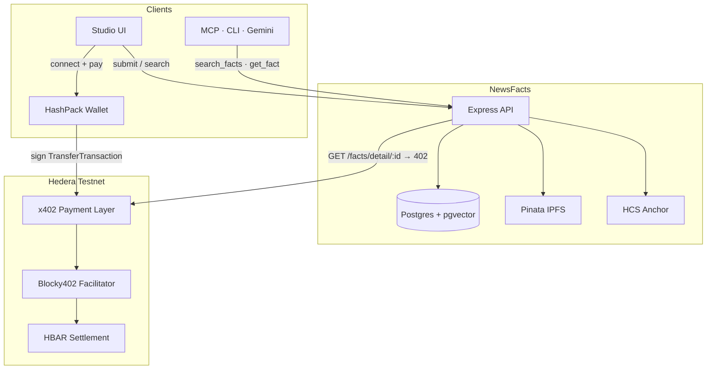

# NewsFacts

> Pay-per-fact eyewitness reports on Hedera. Search is free — full details cost HBAR via x402.

**Live demo:** https://130-210-48-232.sslip.io

Anyone can publish facts and search summaries for free. Reading the full detail triggers a native Hedera payment (`402 → sign → settle`). AI agents use the same API through MCP, CLI, or Gemini.

---

## Architecture



**Flow:** submit fact → search (free) → request detail → `402 Payment Required` → buyer signs HBAR transfer → Blocky402 settles → full fact + HashScan proof.

---

## Quick start

```bash
cp .env.example .env
npm install
npm run server          # http://localhost:3002
```

In Neon SQL editor (once): `CREATE EXTENSION IF NOT EXISTS vector;`

```bash
npm run client          # CLI: search + pay one fact
npm run verify:testnet  # live testnet: create → 402 → pay → HashScan
```

Open the Studio → **Submit** to publish, **Search & Pay** to query and pay with HashPack (testnet account required).

---

## Verified on testnet

Live x402 fact payments:

1. https://hashscan.io/testnet/transaction/0.0.7162784@1785560633.399490232
2. https://hashscan.io/testnet/transaction/0.0.7162784@1785560650.926451354
3. https://hashscan.io/testnet/transaction/0.0.7162784@1785560671.476364371
4. https://hashscan.io/testnet/transaction/0.0.7162784@1785560691.551103945
5. https://hashscan.io/testnet/transaction/0.0.7162784@1785560708.797433584

- **Buyer:** https://hashscan.io/testnet/account/0.0.9769419
- **Seller:** https://hashscan.io/testnet/account/0.0.9733389

Reproduce: `npm run server` → `npm run verify:testnet`

---

## Stack

| Layer | Tech |
|---|---|
| API | Express 5, TypeScript |
| Storage | Postgres + pgvector (Neon) |
| Payments | `@x402/hedera`, Blocky402 facilitator |
| Wallet | HashPack (browser, Hedera testnet) |
| Media | Pinata IPFS |
| On-chain | HCS fact anchoring |
| Agents | MCP server, Gemini (`gemini-3.1-flash-lite`) |

---

## Config

Essential env vars — full list in [`.env.example`](.env.example):

| Variable | Purpose |
|---|---|
| `DATABASE_URL` | Postgres with pgvector |
| `SELLER_ACCOUNT_ID` | Receives x402 payments |
| `HEDERA_ACCOUNT_ID` / `HEDERA_PRIVATE_KEY` | Buyer for CLI/MCP/agent |
| `REOWN_PROJECT_ID` | HashPack browser wallet |
| `PINATA_JWT` | Photo uploads to IPFS |
| `GEMINI_API_KEY` | Agent demo (`demo:full`) |

---

## Deploy

- **Oracle VM:** `deploy/deploy-to-oracle.sh` (HTTPS via sslip.io required for HashPack)
- **Render:** Blueprint from [`render.yaml`](render.yaml) — health check `GET /health`

---

## Bounty

Built for the [Hedera x402 Bounty](https://hedera.com/x402-bounty/). Demo script and checklist → **[BOUNTY.md](BOUNTY.md)**

---

## Links

- [Hedera x402 docs](https://docs.hedera.com/solutions/ai/x402)
- [@x402/hedera](https://github.com/x402-foundation/x402/tree/main/typescript/packages/mechanisms/hedera)
- [Blocky402 facilitator](https://api.testnet.blocky402.com/supported)
- [HashScan testnet](https://hashscan.io/testnet)
